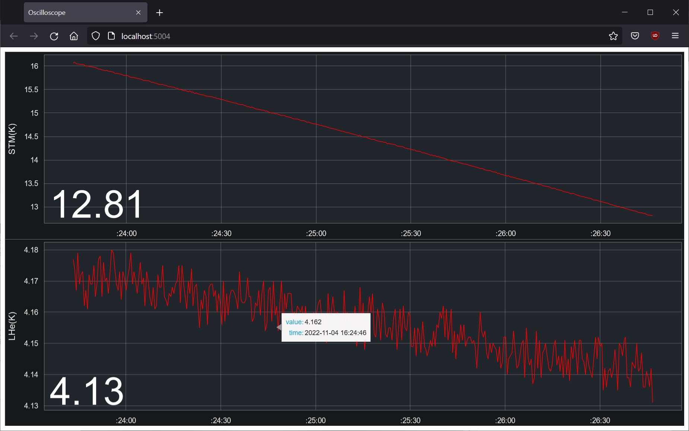
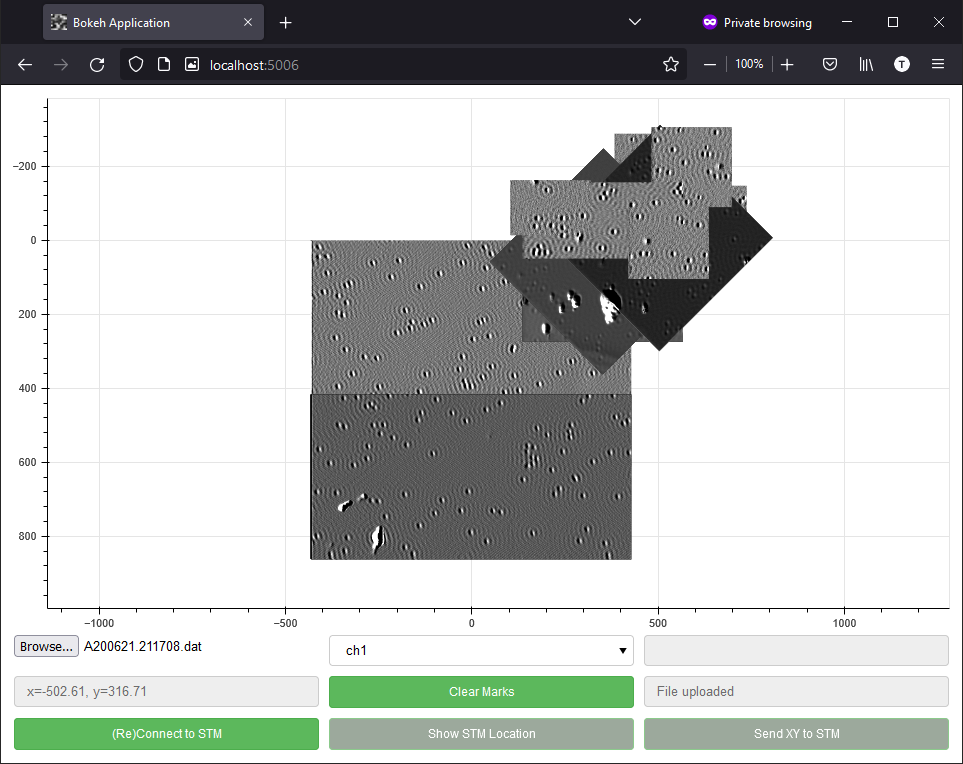
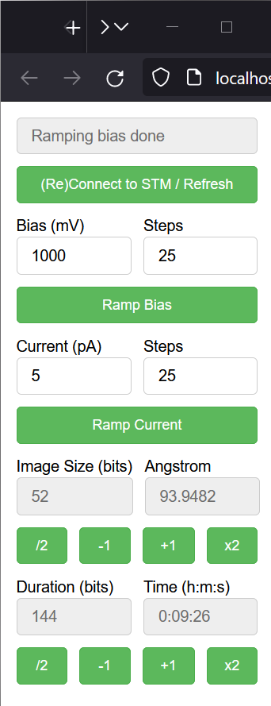

Py-Createc
==========
.. image:: https://readthedocs.org/projects/py-createc/badge/?version=latest
    :target: https://py-createc.readthedocs.io/en/latest/?badge=latest
    :alt: Documentation Status

This is a Python interface package for the `CreaTec scanning probe microscope <https://www.createc.de/LT-STMAFM>`_. This package serves two main purposes:

1. **Python Interface for Createc STM**: It includes a wrapper class (`createc.CreatecWin32`) that interfaces with the Createc STM software. This component offers enhanced access to all standard remote operations, with additional custom methods such as ``ramp_bias_mV`` and ``ramp_current_pA``, extending the capabilities beyond the default functions.

2. **File Management and Analysis Tools**: Besides interfacing with the STM, Py-Createc features a suite of classes for handling and analyzing the data files (.dat, .vert, etc.) generated by the STM. These tools, developed independently, allow for efficient and effective management of STM data, offering functionalities such as image instance creation and more.

The online documentation can be found `here <https://py-createc.readthedocs.io>`_.

Installation
------------

Installation of the package can be done through `PIP <https://pip.pypa.io>`_:

``pip install createc``

Or in the root directory, run
``pip install -e .``

Quickstart
----------

**Interfacing with Createc STM**

.. code-block::

   import createc
   stm = createc.CreatecWin32()
   stm.stmbeep()  # Playing the testing beep sound on the STM
   stm.ramp_bias_mV(1000)  # Ramping bias to 1V

**Handling STM Data Files**

Furthermore, several classes are available to to read ``.dat``, ``.vert`` files etc.
For example, an image instance can be created by:

.. code-block::

   import createc
   image_file = createc.DAT_IMG('path/to/filename.dat')

File Structure
--------------

.. code-block::

   .
   +-- createc  # The main modules
   |   +-- Createc_pyCOM  
   |   |  +-- CreatecWin32  # The wrapper class that expands the scope of default Createc functions. The .ramp_bias_mV and .ramp_current_pA methods are in here
   |   |
   |   +-- Createc_pyFile  # The unified Createc file classes
   |      +-- GENERIC_FILE  # The parent file class
   |      |  +-- DAT_IMG(GENERIC_FILE)  # The child class for reading .dat files
   |      |  +-- VERT_SPEC(GENERIC_FILE)  # The child class for reading .vert files
   |      +-- GRID_SPEC  # A standalone class for .gridspec files
   |
   +-- examples
   |   +-- map  # An applet to map out a bunch of images according to their locations/angles, useful for offline images-viewing
   |   +-- osc  # An applet to show real time STM signals, the channels can be easily configured inside the script
   |   +-- utility  # A helper applet for the STM operation, The .ramp_bias_mV and .ramp_current_pA methods are in here. (see screenshots below)
   |
   +-- tests
   +-- doc
   +-- LICENSE
   +-- README

More Elaborate Examples
-----------------------

The `examples folder <https://github.com/chenxu2394/py_createc/tree/main/examples>`_ contains useful scripts to communicate with the STM.
These scripts show off the more advanced applications of the Py-Createc package.

1. Here is an oscilloscope from ``./examples/osc/oscilloscope.py``, which shows the temperatures of the STM. The value and its timestamp can be shown upon hovering the cursor over the curves. Other signals can also be displayed with some configuration.

2. And below is a helper applet from ``./examples/map/map.py``, which can help to piece together images scanned at different locations. It can also communicate with the STM upon clicking 'Connect to STM', where the applet can synchronize its tip position with the STM.

3. And this is a helper applet from ``./examples/utility/stm_tool.py``. Here the user only needs a single click to change STM parameters.

API Documentation
-----------------

Finally, there is the comprehensive `API documentation <https://py-createc.readthedocs.io/en/latest/api.html#api-documentation>`_.

Author
------
Chen Xu <cxu.self@gmail.com>
